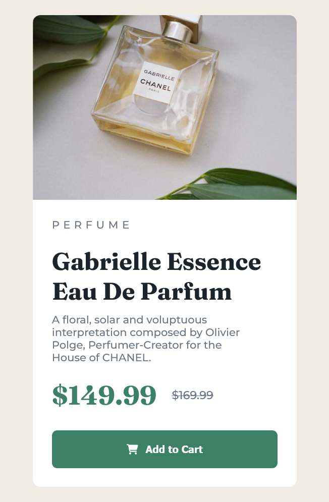
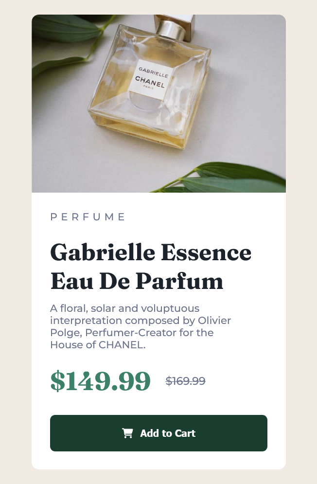

<h1> Frontend Mentor - Product preview card component solution </h1>
This is a solution to the <a href="https://www.frontendmentor.io/challenges/product-preview-card-component-GO7UmttRfa"> Product preview card component challenge on Frontend Mentor</a>. Frontend Mentor challenges help you improve your coding skills by building realistic projects. 
<h2>Overview</h2>
The purpose of this challenge consists of building an Product preview card component that looks as close as possible to the provided design.
When realizing this project you will be able to: 

<ul>
  <li>View the optimal layout depending on their device's screen size.</li>
  <li>See hover and focus states for interactive elements.</li>
</ul>
<h3>Screenshot</h3>
<h3>1- DESKTOP </h3>

<h3>2- MOBILE </h3>

<h3>3- MOBILE + HOVER </h3>

<h3>Links</h3>
<ul>
  <li>Solution URL: <a href="https://www.frontendmentor.io/solutions/responsive-card-component-using-css-flexbox-rwABGecGj8"> My Solution </a> </li>
  <li>Live Site URL:  <a href="https://scintillating-kitsune-2ef26b.netlify.app/"> Live Demo </a></li>
</ul>

<h2>My process</h2>
<h3>Built with </h3>
<ul>
  <li>Semantic HTML5 markup.</li>
  <li>CSS.</li>
  <li>Flexbox.</li>
</ul>

<h3>Useful resources</h3>
<ul>
  <li><a href="https://www.w3schools.com/css/css3_flexbox_container.asp">CSS Flex Container</a> helped me understand how to manage the layouts since it is one of the most challenging aspects of this project.</li>
</ul>
